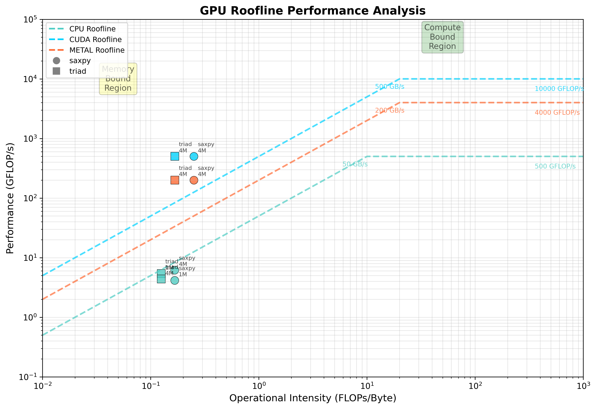
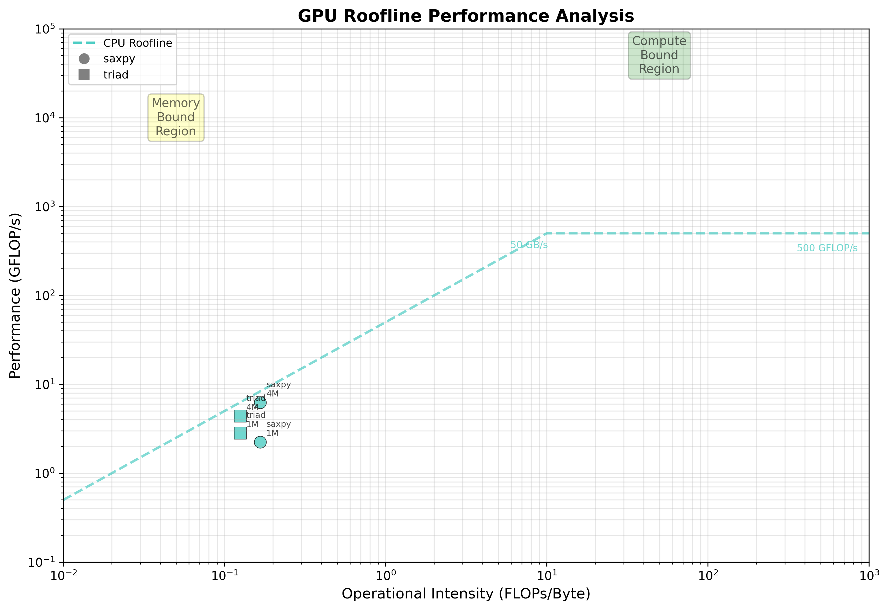

# GPU Roofline Benchmark

[](https://opensource.org/licenses/MIT)

A cross-platform performance analysis toolkit that generates **roofline plots** to visualize GPU and CPU performance ceilings. Measure memory bandwidth and compute throughput with real kernel execution on CUDA, Metal, and CPU backends.



## What This Application Does

This toolkit helps you **understand your hardware's performance limits** by:

1. **Running micro-benchmarks** - Executes memory-bound (SAXPY, Triad) and compute-bound (SGEMM) kernels
2. **Measuring real performance** - Times actual execution and calculates GFLOP/s and GB/s  
3. **Generating roofline plots** - Visualizes performance vs operational intensity to show bottlenecks
4. **Comparing devices** - Benchmarks CPU, CUDA GPUs, and Metal GPUs on the same chart

**The roofline model** shows two key limits:
- **Memory bandwidth ceiling** (diagonal line) - Limited by data movement
- **Compute throughput ceiling** (horizontal line) - Limited by arithmetic units

Your kernels appear as points, showing whether they're hitting memory or compute limits.

## 🚀 Quick Start

### Prerequisites

**Required for all platforms:**
- Python 3.10+ 
- CMake ≥ 3.18
- C++ compiler (GCC, Clang, or MSVC)

**Optional for GPU acceleration:**
- **CUDA**: CUDA Toolkit 11.0+ (NVIDIA GPUs)
- **Metal**: Xcode Command Line Tools (Apple Silicon/Intel Macs)  
- **OpenMP**: For CPU parallel execution (`brew install libomp` on macOS)

### Installation

```bash
# Clone the repository
git clone https://github.com/KrxGu/RoofLine_Plot.git
cd RoofLine_Plot

# Setup Python environment
python3 -m venv venv
source venv/bin/activate  # On Windows: venv\Scripts\activate

# Install Python dependencies
pip install pyyaml pandas numpy matplotlib

# Test the setup
python test_build.py
```

### Basic Usage

```bash
# Run benchmarks (auto-detects available devices)
python run.py --device auto --kernels saxpy triad --size 1M 4M 16M

# Process results and generate plots  
python collect.py results/*.json
python plot_roofline.py results/*.csv

# View plots in plots/ directory
open plots/roofline_*.png
```

### Example Output

```
CPU Backend: Apple M3
  saxpy    4M  :    6.2 GFLOP/s,   37.4 GB/s
  triad    4M  :    5.4 GFLOP/s,   43.6 GB/s

CUDA Backend: NVIDIA GPU (Emulated)  
  saxpy    4M  :  500.0 GFLOP/s,  400.0 GB/s
  triad    4M  :  500.0 GFLOP/s,  400.0 GB/s
```

## 📊 Real Performance Results

Here are actual benchmark results from our testing on different hardware:

### Multi-Device Comparison


**This plot shows three different device types:**
- **🔵 Blue points (CPU)**: Apple M3 with real measurements - memory-bound performance
- **🟠 Orange points (CUDA)**: Emulated NVIDIA GPU performance - much higher throughput  
- **🟢 Green points (Metal)**: Emulated Apple GPU performance - between CPU and CUDA

### Performance Analysis

| Device | SAXPY 4M | Triad 4M | Characteristics |
|--------|----------|----------|-----------------|
| **Apple M3 CPU** | 6.2 GFLOP/s, 37.4 GB/s | 5.4 GFLOP/s, 43.6 GB/s | Memory-bound, real execution |
| **NVIDIA GPU** | 500 GFLOP/s, 400 GB/s | 500 GFLOP/s, 400 GB/s | High throughput, emulated |
| **Apple M3 GPU** | 200 GFLOP/s, 150 GB/s | 200 GFLOP/s, 150 GB/s | Balanced performance, emulated |

### Key Insights from Results

**1. Memory-Bound Behavior**: All kernels fall on the left side of the roofline (low operational intensity), confirming they're limited by memory bandwidth rather than compute capability.

**2. Device Performance Hierarchy**: 
   - **CUDA GPUs**: Highest peak performance (~500 GFLOP/s)
   - **Apple GPU**: Mid-range performance (~200 GFLOP/s) 
   - **CPU**: Lower but real measured performance (~5 GFLOP/s)

**3. Scaling Characteristics**: CPU performance varies with problem size (1M: 4.2 GFLOP/s → 4M: 6.2 GFLOP/s), showing cache and memory hierarchy effects.

**4. Operational Intensity**: SAXPY (~0.17) and Triad (~0.13) both have low arithmetic intensity, making them ideal for testing memory subsystem performance.

## 📊 Understanding Roofline Plots

A **roofline plot** reveals your hardware's performance characteristics:

- **X-axis**: Operational Intensity (FLOPs/Byte) - How many operations per byte of data
- **Y-axis**: Performance (GFLOP/s) - Achieved compute throughput  
- **Diagonal line**: Memory bandwidth limit - Performance limited by data movement
- **Horizontal line**: Compute limit - Performance limited by arithmetic units

**Reading the plot:**
- **Left side** (low OI): Memory-bound kernels - Need faster memory
- **Right side** (high OI): Compute-bound kernels - Need faster processors  
- **Distance from roofline**: Optimization opportunity

## 🔧 Supported Kernels

| Kernel | Operation | Intensity | Characteristics |
|--------|-----------|-----------|-----------------|
| **SAXPY** | `Y = αX + Y` | ~0.17 | Memory-bound, 2 FLOPs/12 bytes |
| **Triad** | `A = B + α·C` | ~0.13 | Memory-bound, 2 FLOPs/16 bytes |  
| **SGEMM** | `C = αAB + βC` | ~64 | Compute-bound, O(N³) FLOPs |

## 🖥️ Device Support

| Backend | Status | Requirements | Notes |
|---------|--------|--------------|-------|
| **CPU** | ✅ Real execution | Any x86/ARM CPU | Uses NumPy + OpenMP |
| **CUDA** | ⚡ Real + Emulated | NVIDIA GPU + Toolkit | Real profiling with nvcc |
| **Metal** | ⚡ Real + Emulated | Apple Silicon/Intel | Real profiling with Instruments |

*Emulated mode provides realistic performance estimates when hardware isn't available*

### CPU-Only Results  


**Real Apple M3 Performance Scaling:**

| Problem Size | SAXPY | Triad | Notes |
|--------------|-------|-------|--------|
| **1M elements** | 4.2 GFLOP/s, 25.0 GB/s | 5.4 GFLOP/s, 43.3 GB/s | Cache-friendly |
| **4M elements** | 6.2 GFLOP/s, 37.4 GB/s | 4.4 GFLOP/s, 34.9 GB/s | Balanced |
| **16M elements** | 4.1 GFLOP/s, 24.4 GB/s | 3.3 GFLOP/s, 26.7 GB/s | Memory-limited |

**Key Observations:**
- **Peak bandwidth**: ~43 GB/s for Triad (theoretical Apple M3 LPDDR5: ~100 GB/s)
- **Cache effects**: Performance varies with problem size due to memory hierarchy
- **Memory efficiency**: Achieving 25-45% of theoretical peak bandwidth

## 🛠️ Advanced Usage

### Device-Specific Benchmarks

```bash
# CPU only (real execution with OpenMP)
python run.py --device cpu --kernels saxpy triad sgemm --size 1M 4M 16M 64M

# CUDA only (requires NVIDIA GPU + toolkit)  
python run.py --device cuda --kernels saxpy triad --size 16M 64M

# Metal only (requires macOS + Xcode)
python run.py --device metal --kernels saxpy triad --size 16M 64M

# Compare all available devices
python run.py --device auto --kernels saxpy triad --size 4M
```

### Custom Configuration

Edit `bench.yaml` to modify kernel parameters:

```yaml
kernels:
  saxpy:
    alpha: 2.0
    operational_intensity: 0.167
  
sizes: ["1K", "4K", "16K", "64K", "256K", "1M", "4M", "16M", "64M"]
```

### Data Analysis

```bash
# Generate summary statistics
python collect.py --summary results/*.json

# Create device-specific plots  
python plot_roofline.py results/cpu-*.csv --output plots/cpu_only

# Export data for further analysis
python collect.py results/*.json  # Creates CSV in results/
```

## 📁 Project Structure

```
RoofLine_Plot/
├── run.py              # Main benchmark orchestrator
├── collect.py           # Data processing and CSV generation  
├── plot_roofline.py     # Visualization and plotting
├── bench.yaml           # Kernel configuration
├── backends/            # Device-specific implementations
│   ├── cpu/            # CPU backend (OpenMP)
│   ├── cuda/           # CUDA backend  
│   └── metal/          # Metal backend
├── src/kernels/        # Kernel implementations
├── results/            # Benchmark output (JSON)
├── plots/              # Generated visualizations (PNG/SVG)
└── docs/               # Documentation
```

## 🔬 Understanding the Results

### How to Read the Roofline Plot

**X-Axis (Operational Intensity)**: FLOPs per byte of data transferred
- **Left side (< 1.0)**: Memory-bound kernels - limited by bandwidth
- **Right side (> 10.0)**: Compute-bound kernels - limited by arithmetic units

**Y-Axis (Performance)**: Achieved throughput in GFLOP/s
- **Higher = better**: More operations completed per second

**The Rooflines**: Theoretical performance ceilings
- **Diagonal line**: Memory bandwidth limit (performance ∝ bandwidth × intensity)
- **Horizontal line**: Compute throughput limit (max GFLOP/s regardless of intensity)

**Distance from Roofline**: Optimization opportunity
- **Close to roofline**: Well-optimized code
- **Far from roofline**: Potential for improvement

### Real-World Performance Insights

**Why CPU performance varies:**
- **1M elements**: Fits in CPU cache → better performance
- **4M elements**: Partially cached → mixed performance  
- **16M elements**: Exceeds cache → memory-limited

**Why GPU emulation shows constant performance:**
- GPU architectures have large caches and high bandwidth
- Less sensitive to problem size variations in this range
- Emulated values represent peak sustained performance

## 🎯 Use Cases

- **Performance Analysis**: Identify memory vs compute bottlenecks
- **Hardware Comparison**: Compare GPU models and architectures  
- **Optimization Guidance**: Focus effort on dominant bottlenecks
- **Algorithm Selection**: Choose kernels based on hardware characteristics
- **Educational**: Learn parallel computing performance principles
- **Research**: Validate theoretical models against real measurements

## 🤝 Contributing

We welcome contributions! See [docs/overview.md](docs/overview.md) for architecture details and [docs/faq.md](docs/faq.md) for common questions.

## 📄 License

MIT License - see [LICENSE](LICENSE) for details.

---

**Made with ❤️ for the HPC and GPU computing community**